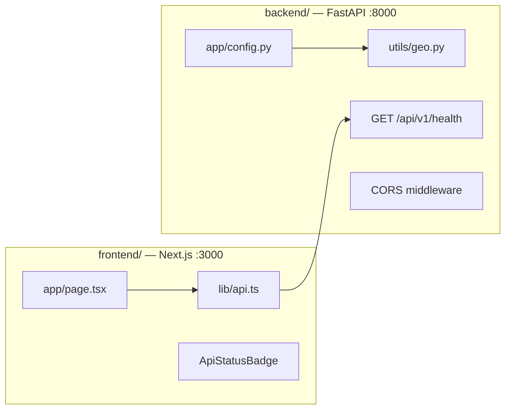

# Phase 0 — Architecture

Excerpt from [project architecture](../../project/architecture.md). Full system diagram and later phases remain in the parent doc.

## Goal

Establish `backend/` + `frontend/` scaffolds and the **Delhi NCR geographic contract**.

## Components

| Component | Responsibility |
|-----------|----------------|
| **Monorepo layout** | `backend/` + `frontend/` + `shared/` + `docs/phases/` |
| **Backend scaffold** | FastAPI, `/api/v1` router, Uvicorn |
| **Frontend scaffold** | Next.js App Router, Tailwind |
| **Config module** | `NCR_BOUNDS`, durations, enums |
| **Env** | `backend/.env` (secrets); `frontend/.env.local` (public API URL only) |
| **Health** | `GET /api/v1/health` |
| **CORS** | `http://localhost:3000` (+ production origin later) |

## Delhi NCR scope

- `NCR_BOUNDS`: min/max lat/lon
- `DEFAULT_CITY`: `"Delhi NCR"`
- `SUPPORTED_DURATIONS`: `4h`, `8h`, `1d`

## API (Phase 0)

| Method | Path | Purpose |
|--------|------|---------|
| GET | `/api/v1/health` | Liveness + version + `poi_count` (null until Phase 1) |

## Exit criteria

- Both apps start locally; health check OK.
- All geographic constants read from `backend/app/config.py` only.
