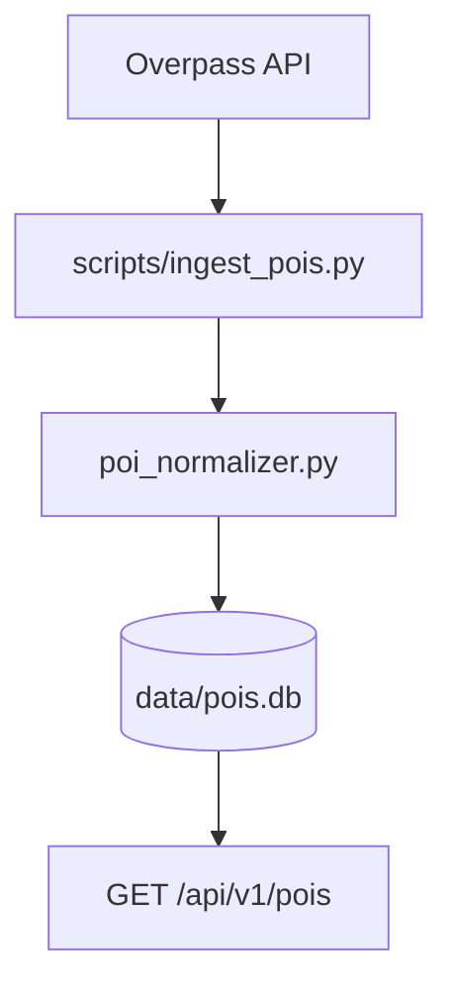

# Phase 1 — Architecture

Excerpt from [project architecture](../../project/architecture.md). Parent doc has the full system view.

## Goal

Build the **Delhi knowledge base**: ingest and query POIs from OpenStreetMap (Overpass), scoped to MVP categories.

## Data flow

**Rule:** Overpass is called only from `make ingest`, never on user requests.

## POI schema (normalized)

| Field | Example |
|-------|---------|
| `id` | `osm:node/12345` |
| `name` | India Gate |
| `category` | `attraction` |
| `lat` / `lon` | WGS84 inside NCR bounds |
| `estimated_visit_minutes` | Per category default |
| `source` | `osm` |

## API

| Method | Path | Purpose |
|--------|------|---------|
| GET | `/api/v1/pois` | List by `category`, `interest`, `limit` |
| GET | `/api/v1/health` | Includes `poi_count` |

## Code locations

| Component | Path |
|-----------|------|
| ORM + repository | `backend/app/db/` |
| Overpass client | `backend/app/services/overpass_client.py` |
| Normalizer | `backend/app/services/poi_normalizer.py` |
| Ingest CLI | `backend/scripts/ingest_pois.py` |
| Query templates | `backend/scripts/overpass_queries/` |
