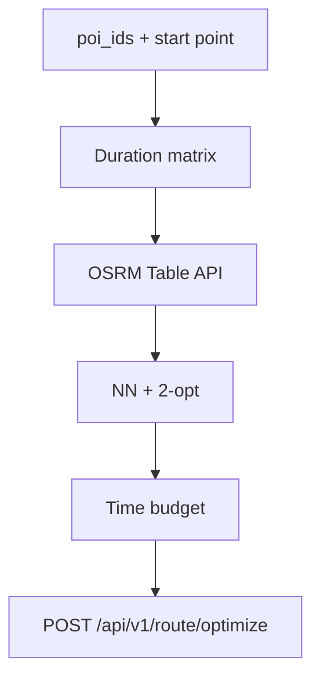

# Phase 2 — Architecture

Excerpt from [project architecture](../../project/architecture.md).

## Goal

Compute **walking travel time** between stops and return a **feasible visit order** within an optional time budget.

## Data flow



Haversine fallback when OSRM fails (`routing_source: haversine`, `warnings[]`).

## API

```http
POST /api/v1/route/optimize
```

| Field | Purpose |
|-------|---------|
| `poi_ids` | Stops from Phase 1 DB |
| `start_lat` / `start_lon` | Route start (Delhi NCR) |
| `mode` | `walking` only (MVP) |
| `max_total_minutes` | Optional; exceed → `422` |

## Code locations

| Component | Path |
|-----------|------|
| OSRM + haversine | `backend/app/services/routing_client.py` |
| Order optimizer | `backend/app/services/order_optimizer.py` |
| Budget validator | `backend/app/services/route_validator.py` |
| Orchestration | `backend/app/services/route_service.py` |
| HTTP | `backend/app/api/v1/route.py` |
