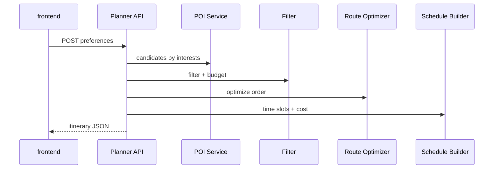

# Phase 3 — Architecture

Excerpt from [project architecture](../../project/architecture.md).

## Goal

Ship end-to-end itinerary generation using **deterministic** logic (no LLM).

## Sequence

## Components (planned)

| Component | Path |
|-----------|------|
| Filter | `backend/app/services/planner/filter.py` |
| Selector | `backend/app/services/planner/selector.py` |
| Scheduler | `backend/app/services/planner/scheduler.py` |
| Cost | `backend/app/services/planner/cost.py` |
| Orchestrator | `backend/app/services/planner/orchestrator.py` |
| API | `backend/app/api/v1/itinerary.py` |
| Schema | `shared/schemas/itinerary.schema.json` |

## API

| Method | Path | Purpose |
|--------|------|---------|
| POST | `/api/v1/itinerary/generate` | Full plan (`mode=rule` default) |
