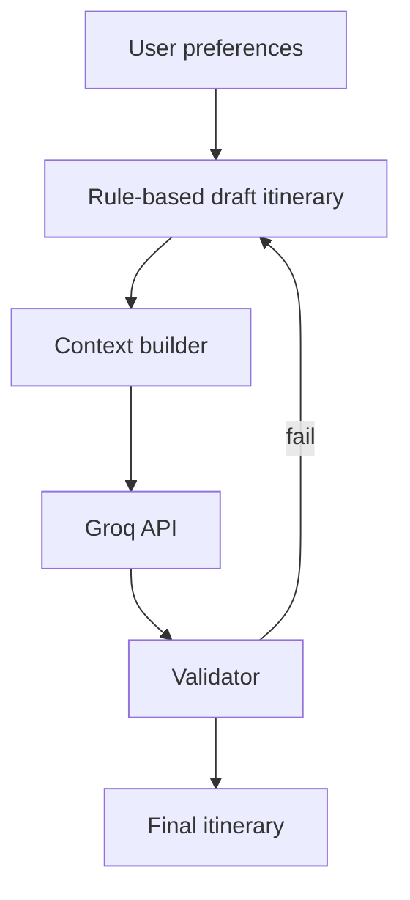

# Phase 4 — Architecture

Excerpt from [project architecture](../../project/architecture.md).

## Goal

**Groq** on backend for personalization and narrative — all stops remain grounded in Phase 1–3 data.

## Flow

## Guardrails

- Closed set of `poi_id` values in prompt
- Validator rejects unknown IDs
- Fallback to Phase 3 rule-based output

## Code locations (planned)

| Component | Path |
|-----------|------|
| Groq client | `backend/app/services/ai/groq_client.py` |
| Context | `backend/app/services/ai/context_builder.py` |
| Prompts | `backend/app/services/ai/prompts.py` |
| Validator | `backend/app/services/ai/validator.py` |

## Config

| Env var | Location |
|---------|----------|
| `GROQ_API_KEY` | `backend/.env` only |
| `GROQ_MODEL` | e.g. `llama-3.3-70b-versatile` |
