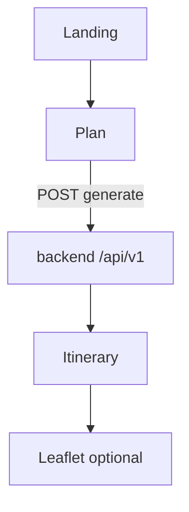

# Phase 5 — Architecture

Excerpt from [project architecture](../../project/architecture.md).

## Goal

User-facing **frontend only** — calls backend REST API; no planner logic in browser.

## Routes (planned)

| Route | Component |
|-------|-----------|
| `/` | Landing |
| `/plan` | PlanForm |
| `/itinerary` | ItineraryTimeline + Map |

## Flow

## Code locations

| Area | Path |
|------|------|
| API client | `frontend/lib/api.ts` |
| Types | `frontend/types/itinerary.ts` |
| Form | `frontend/components/plan/PlanForm.tsx` |
| Timeline | `frontend/components/itinerary/` |
