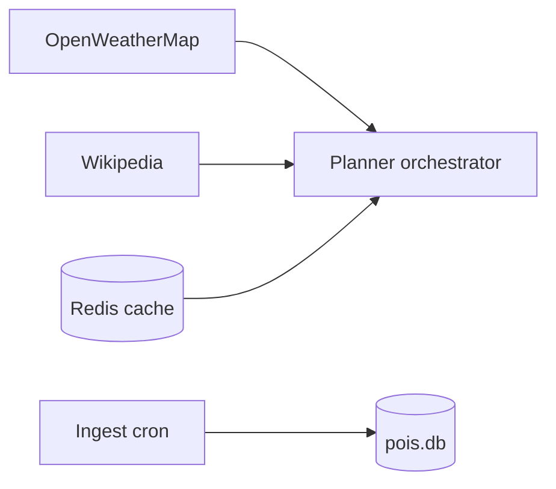

# Phase 6 — Architecture

Excerpt from [project architecture](../../project/architecture.md).

## Goal

Improve richness and reliability **without** breaking Phase 3–5 API contracts.

## Integration points

| Enhancement | When to call |
|-------------|--------------|
| Weather | If `plan_date` provided; else skip |
| Wikipedia | After itinerary built; enrich `notes` |
| POI refresh | Background job only |
| Redis | Optional perf layer for matrix/POI |
