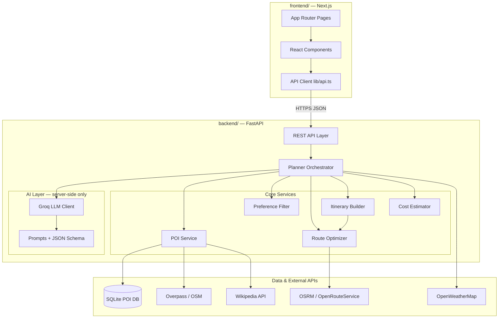
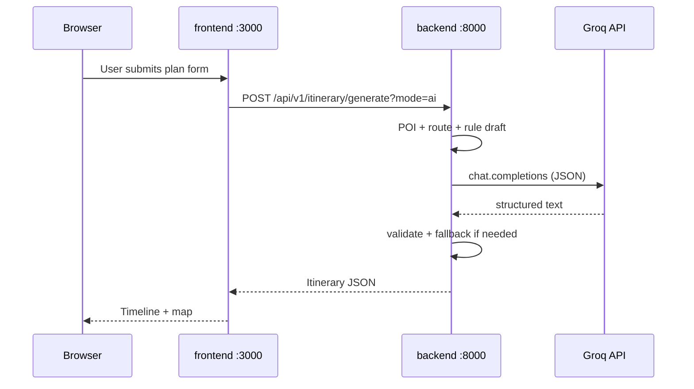
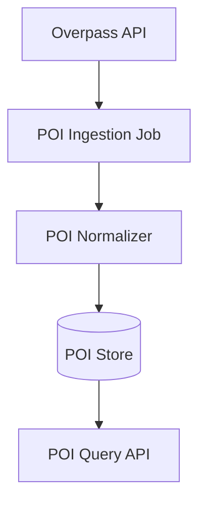
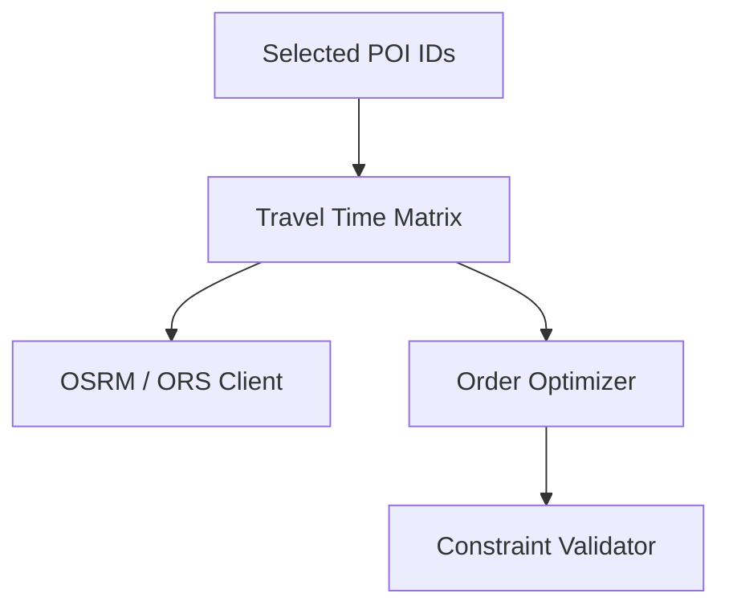
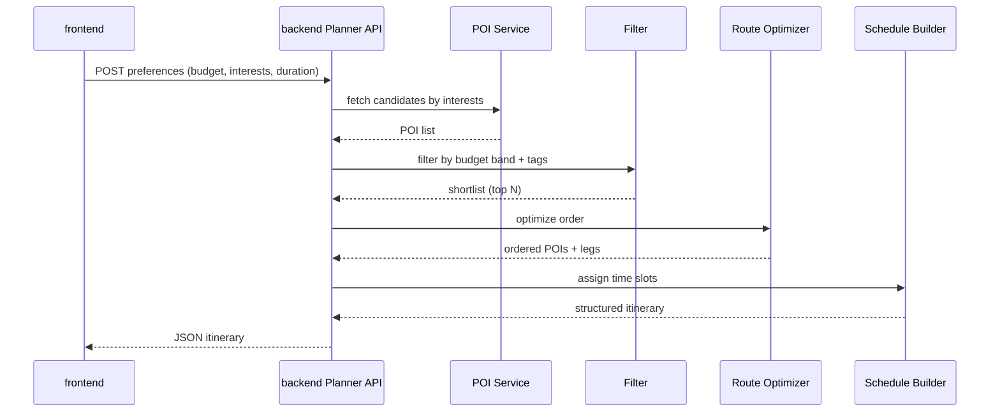
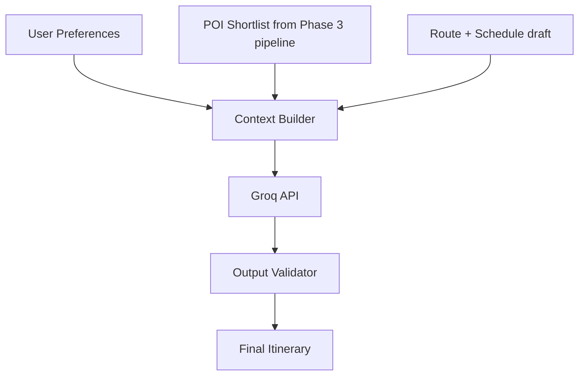
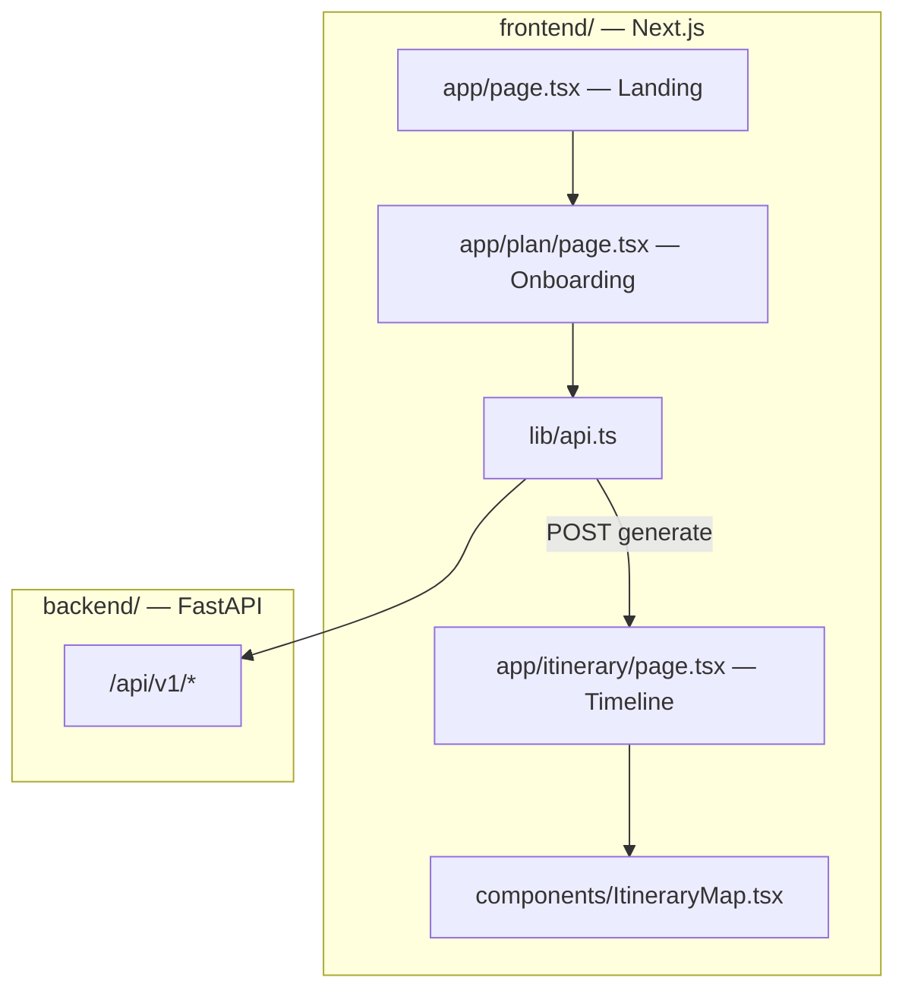
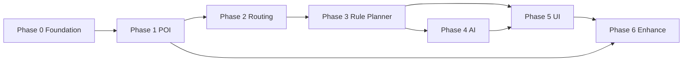

# Phase-Wise Architecture: AI Trip Planner (Delhi MVP)

This document defines how the system is built **incrementally**, aligned with [problemStatement.md](./problemStatement.md). Each phase has a clear goal, components, data flow, and exit criteria before the next phase starts.

**Per-phase documentation:** [`docs/phases/`](../phases/) (Phase 0 complete: [`phase-0-foundation/`](../phases/phase-0-foundation/)).  
**Repository layout:** [repository-structure.md](./repository-structure.md).

---

## High-Level Target Architecture (End State)

The system is a **split frontend / backend** application. The browser talks only to the **backend REST API**; the backend owns data, routing, planning, and **Groq** calls. The frontend never holds `GROQ_API_KEY` or calls Groq directly.



**Design principles**

- **Separated frontend and backend:** Independent deployables, versioned API contract, CORS between origins in dev/prod.
- **Data-first:** POIs and routes come from real APIs; Groq narrates and enriches — it does not invent venues.
- **Delhi NCR boundary:** All geographic queries are scoped to a fixed bounding box / admin area.
- **Free-tier data (MVP):** OSM, OSRM, etc. remain free; **Groq** is the only LLM dependency (fast inference, free tier available).

---

## Application Split: Frontend & Backend

### Responsibilities

| Concern | `backend/` (FastAPI) | `frontend/` (Next.js) |
|---------|----------------------|------------------------|
| User input validation (authoritative) | Yes — Pydantic on every POST | Yes — form validation before submit |
| POI database & ingest | Yes | No |
| OSRM / routing / TSP | Yes | No |
| Rule-based itinerary | Yes | No |
| Groq API calls | Yes — `services/ai/groq_client.py` | **Never** |
| Render UI, maps, timeline | No | Yes |
| Session / itinerary display state | Optional `itinerary_id` in API only | React state, URL, or sessionStorage |
| Secrets | `.env` on server | Only `NEXT_PUBLIC_API_URL` |

### Communication contract

| Item | Value |
|------|--------|
| Protocol | REST over HTTPS (HTTP locally) |
| Format | JSON (`Content-Type: application/json`) |
| Auth (MVP) | None — rate limit by IP on backend |
| Base URL (dev) | Backend `http://localhost:8000`, Frontend `http://localhost:3000` |
| API prefix | `/api/v1` (recommended) e.g. `/api/v1/itinerary/generate` |
| Errors | `{ "error": { "code", "message", "details" } }` |
| Docs | OpenAPI at `GET /docs` (FastAPI auto-generated) |

### Fixed tech stack

| Layer | Technology | Notes |
|-------|------------|--------|
| **Backend** | Python 3.11+, **FastAPI**, Uvicorn | All business logic |
| **Backend DB** | SQLite + SQLAlchemy | `data/pois.db`; migrate to Postgres later if needed |
| **Frontend** | **Next.js 15** (App Router), TypeScript, Tailwind CSS | Marketing + planner UI |
| **Frontend HTTP** | Native `fetch` + typed wrappers in `lib/api.ts` | Optional OpenAPI codegen |
| **LLM** | **Groq** ([console.groq.com](https://console.groq.com)) | OpenAI-compatible API; JSON-capable models |
| **Maps (UI)** | Leaflet + OpenStreetMap tiles | Frontend only |
| **Monorepo** | pnpm workspaces (`frontend`, `backend` packages) | Root `package.json` orchestrates dev |
| **Deploy** | Vercel → `frontend/`, Railway/Fly → `backend/` | Separate env per app |

### Repository layout

```
AITripPlanner/
├── docs/                       # All documentation
│   ├── project/                # Global specs
│   └── phases/                 # Per-phase (phase-0-foundation ✅)
├── backend/                    # Python FastAPI — REST API
│   ├── app/
│   │   ├── main.py
│   │   ├── config.py
│   │   ├── api/v1/             # route handlers
│   │   ├── models/             # Pydantic schemas
│   │   ├── services/
│   │   │   ├── planner/
│   │   │   └── ai/
│   │   │       ├── groq_client.py
│   │   │       ├── context_builder.py
│   │   │       └── validator.py
│   │   └── db/
│   ├── scripts/ingest_pois.py
│   ├── tests/
│   └── pyproject.toml
├── frontend/                   # Next.js — UI only
│   ├── app/                    # App Router: /, /plan, /itinerary
│   ├── components/
│   ├── lib/api.ts              # Backend client
│   ├── types/itinerary.ts      # Mirrors shared schema
│   └── package.json
├── shared/schemas/             # itinerary.schema.json — contract both sides
├── data/                       # SQLite (gitignored)
├── docker-compose.yml          # backend + optional frontend
├── pnpm-workspace.yaml
└── README.md
```

### Local development flow



---

## Phase Overview

| Phase | Name | Goal | User-visible outcome |
|-------|------|------|----------------------|
| **0** | Foundation | Repo, config, Delhi geo scope | Runnable skeleton |
| **1** | POI data layer | Delhi POI knowledge base | List/search real places |
| **2** | Routing & constraints | Feasible travel times & order | Optimized stop sequence |
| **3** | Rule-based planner | End-to-end itinerary without LLM | Full structured itinerary (deterministic) |
| **4** | AI layer | Personalization + natural language | Polished, preference-aware plan |
| **5** | Product shell | Onboarding UI + itinerary UX | Shippable MVP demo |
| **6** | Enhancements (optional) | Weather, Wikipedia, caching | Richer context & reliability |

Phases **0 → 5** deliver the MVP described in the problem statement. Phase **6** is post-MVP polish.

---

## Phase 0: Foundation — Complete

Full Phase 0 spec, checklist, and task list:

**[`docs/phases/phase-0-foundation/`](../phases/phase-0-foundation/)**

Implemented in repo root: `backend/` (FastAPI) + `frontend/` (Next.js). Summary:

- `GET /api/v1/health`, CORS, standard errors, `app/config.py` (NCR bounds)
- Landing page with API status badge; no secrets in frontend
- Exit criteria: see [checklist.md](../phases/phase-0-foundation/checklist.md)

---

## Phase 1: POI Data Layer

### Goal

Build the **Delhi knowledge base**: ingest and query POIs from OpenStreetMap (Overpass), scoped to MVP categories.

### Architecture



### POI schema (normalized)

```json
{
  "id": "osm:node/12345",
  "name": "India Gate",
  "category": "monument",
  "tags": ["history", "outdoor"],
  "lat": 28.6129,
  "lon": 77.2295,
  "opening_hours": "24/7",
  "estimated_visit_minutes": 45,
  "source": "osm"
}
```

### OSM categories (MVP)

| Interest (user) | OSM tags / types |
|-----------------|------------------|
| Food | `amenity=cafe`, `amenity=restaurant` |
| History | `historic=*`, `tourism=attraction` |
| Nature | `leisure=park`, `natural=*` |
| Nightlife | `amenity=bar`, `amenity=pub` (subset for MVP) |

### Components

| Component | Responsibility |
|-----------|----------------|
| **Overpass client** | Query POIs inside `NCR_BOUNDS` by category |
| **Ingestion job** | One-off or scheduled refresh; rate-limit friendly |
| **Normalizer** | Map OSM tags → internal `category` + `tags` |
| **POI store** | SQLite/JSON file/Postgres — start simple (SQLite or JSON) |
| **POI Query API** | `GET /api/v1/pois?category=&bbox=` (backend) |

### Deliverables

- [ ] Overpass queries for Delhi NCR MVP categories
- [ ] Persisted POI dataset (≥ hundreds of usable records)
- [ ] POI search/list API

### Exit criteria

- Can list POIs by category within Delhi NCR without calling Overpass on every user request (cached store).
- Each POI has `id`, `name`, `lat`, `lon`, `category`.

---

## Phase 2: Routing & Constraints — Complete

Full spec: [`docs/phases/phase-2-routing/`](../phases/phase-2-routing/)

### Goal

Compute **travel time** between stops and produce a **feasible visit order** for a given set of POIs and time budget.

### Architecture



### Components

| Component | Responsibility |
|-----------|----------------|
| **Routing client** | OSRM Table API (or OpenRouteService matrix) — walking default |
| **Travel time matrix** | Pairwise durations for N stops |
| **Order optimizer** | Greedy / nearest-neighbor or 2-opt TSP heuristic (keep simple for MVP) |
| **Constraint validator** | Total time ≤ user budget; per-leg sanity checks |

### Constraint rules

| Constraint | Source |
|------------|--------|
| Time budget | User input (4h / 8h / 1 day) |
| Visit duration | Default per category + override on POI |
| Travel mode | Walking (MVP); driving optional later |
| Opening hours | POI field when available; else assume daytime |

### API sketch

```
POST /api/v1/route/optimize
Body: { "poi_ids": [...], "start_lat", "start_lon", "mode": "walking" }
Response: { "ordered_poi_ids": [...], "legs": [{ "from", "to", "duration_min" }] }
```

### Deliverables

- [ ] Routing client integrated (OSRM primary)
- [ ] Optimize endpoint returning ordered stops + leg durations
- [ ] Validator rejecting plans that exceed time budget

### Exit criteria

- Given 4–8 POIs, system returns an order with realistic travel legs.
- Sum(visit time + travel time) ≤ user time budget for test cases.

---

## Phase 3: Rule-Based Itinerary Builder (No LLM)

### Goal

Ship **end-to-end itinerary generation** using deterministic logic — proves the pipeline before adding AI cost/complexity.

### Architecture



### Components

| Component | Responsibility |
|-----------|----------------|
| **Preference filter** | Map interests → categories; budget → max POI count / venue types |
| **Candidate selector** | Pick top N POIs (e.g. N=5–8) by diversity of category |
| **Schedule builder** | Start time → assign blocks: visit + travel + buffer |
| **Cost estimator** | Rough ₹ ranges from budget tier + category heuristics |
| **Itinerary schema** | Stable JSON contract for UI and later LLM |

### Itinerary output schema

```json
{
  "meta": { "city": "Delhi NCR", "duration_minutes": 480, "budget_tier": "medium" },
  "stops": [
    {
      "order": 1,
      "poi_id": "osm:...",
      "name": "...",
      "arrive_at": "09:00",
      "depart_at": "10:00",
      "visit_minutes": 60,
      "travel_to_next_minutes": 25,
      "cost_estimate_inr": { "low": 0, "high": 200 },
      "notes": ""
    }
  ],
  "summary": { "total_stops": 5, "total_travel_min": 90, "total_cost_inr": { "low": 500, "high": 1500 } }
}
```

### Deliverables

- [ ] `POST /api/v1/itinerary/generate` (rule-based, `mode=rule` default)
- [ ] Stable itinerary JSON schema
- [ ] Unit tests on time-budget and ordering

### Exit criteria

- Preferences → structured itinerary in one API call, no LLM.
- Meets problem-statement success criteria for time legs and real POIs.

---

## Phase 4: AI Layer (Groq)

### Goal

Add the **Groq-powered LLM layer** on the **backend only** for personalization, narrative, and intelligent selection — while **grounding** every stop in Phase 1–3 data.

### Architecture



### Groq integration

| Setting | Value |
|---------|--------|
| API base | `https://api.groq.com/openai/v1` |
| Client | Official `groq` Python SDK **or** `openai` SDK with `base_url` override |
| Env vars | `GROQ_API_KEY`, `GROQ_MODEL` (e.g. `llama-3.3-70b-versatile`) |
| Output | `response_format: { "type": "json_object" }` where model supports it |
| Timeout | 25s; on failure → rule-based fallback |
| Rate limits | Respect Groq free-tier RPM; cache identical prompts in Phase 6 |

**Recommended MVP models (Groq):** `llama-3.3-70b-versatile` (quality) or `llama-3.1-8b-instant` (speed). Pin model name in config, not hardcoded in multiple files.

**Security:** `GROQ_API_KEY` lives only in `backend/.env`. Frontend `mode=ai` is a query flag — it does not pass any LLM credentials.

### Two integration patterns (pick one for MVP)

| Pattern | Description | When to use |
|---------|-------------|-------------|
| **A. AI as narrator** | Phases 1–3 produce itinerary; LLM adds descriptions, tips, reorder suggestions within validator bounds | Faster, safer MVP |
| **B. AI as selector** | LLM picks POI subset from retrieved list; system optimizes route | More “AI-native” feel |

**Recommended for MVP:** Pattern **A**, then evolve to **B**.

### Components

| Component | Responsibility |
|-----------|----------------|
| **Context builder** | Inject only allowed POI IDs, weather snippet, user prefs |
| **Prompt templates** | System prompt: “only use provided POI ids” |
| **Structured output** | Groq JSON object mode → parse into itinerary schema |
| **Validator** | Reject if unknown `poi_id` or times exceed budget; fallback to rule-based |
| **Groq client** | `services/ai/groq_client.py` — single adapter for chat completions |

### Guardrails

- Groq receives **closed set** of POIs (names + ids + metadata), not open-ended geography.
- Post-generation: validate all `poi_id` exist in shortlist; re-run route optimizer if order changes.
- On validation failure → return Phase 3 rule-based itinerary (graceful degradation).

### Deliverables

- [ ] `POST /api/v1/itinerary/generate?mode=ai` (Groq on backend)
- [ ] Prompt + schema + validator
- [ ] Fallback to rule-based planner

### Exit criteria

- AI itinerary passes same validator as rule-based.
- No hallucinated venues in acceptance tests.
- Latency acceptable for demo (target &lt; 30s with streaming optional).

---

## Phase 5: Frontend Application (Shippable MVP)

### Goal

Deliver the **`frontend/`** experience: onboarding → call backend → display itinerary. No planner logic in the browser.

### Architecture



### Routes (App Router)

| Route | Purpose |
|-------|---------|
| `/` | Landing, CTA → `/plan` |
| `/plan` | Onboarding form |
| `/itinerary` | Results (state from navigation or sessionStorage) |

### Screens

| Screen | Fields / actions |
|--------|------------------|
| **Onboarding** | Budget (low/medium/high), interests (multi-select), duration (4h/8h/1d), toggle “AI tips (Groq)” → `mode=ai` |
| **Loading** | Spinner while backend runs (Groq may add 5–20s) |
| **Itinerary** | Timeline, map pins, cost summary, regenerate |
| **Error** | Show `error.message` from API; retry button |

### Frontend components

| Component | Path | Responsibility |
|-----------|------|----------------|
| `PlanForm` | `components/plan/PlanForm.tsx` | Controlled form + client validation |
| `ItineraryTimeline` | `components/itinerary/ItineraryTimeline.tsx` | Stops, travel legs, times |
| `WarningsBanner` | `components/itinerary/WarningsBanner.tsx` | `meta.warnings` |
| `ItineraryMap` | `components/itinerary/ItineraryMap.tsx` | Leaflet + OSM tiles |
| `ApiClient` | `lib/api.ts` | `generateItinerary()`, `checkHealth()` |

### Deliverables

- [ ] All routes and components above
- [ ] Typed DTOs aligned with `shared/schemas/itinerary.schema.json`
- [ ] Deploy: Vercel (`frontend/`) + Railway/Fly (`backend/`)

### Exit criteria

- Non-technical user completes flow in **&lt; 3 minutes** (problem statement).
- Frontend bundle contains **no** `GROQ_API_KEY` or server secrets.
- Matches MVP scope: Delhi NCR, day/half-day only.

---

## Phase 6: Enhancements (Post-MVP)

### Goal

Improve richness and reliability without breaking core architecture.

| Enhancement | Integration point |
|-------------|-------------------|
| **OpenWeatherMap** | Context builder → bias indoor POIs on rain/heat |
| **Wikipedia API** | Enrich stop `notes` with historical blurb |
| **POI refresh job** | Scheduled Overpass re-ingest |
| **Google Places** | Optional popularity signal (watch free-tier limits) |
| **Caching** | Redis for matrix + POI hot queries |
| **Analytics** | Anonymous funnel: form → generate → view |

---

## Cross-Phase Dependency Graph



**Critical path:** 0 → 1 → 2 → 3 → 5 (LLM optional for first demo).  
**Parallelizable after Phase 3:** Phase 4 (AI) and Phase 5 (UI) can proceed in parallel if API contract is frozen.

---

## API Contract Summary (Stable Across Phases)

All endpoints are served by **`backend/`** under prefix `/api/v1`. The **`frontend/`** consumes only these routes.

| Endpoint | Phase | Purpose |
|----------|-------|---------|
| `GET /api/v1/health` | 0 | Liveness + `poi_count` |
| `GET /api/v1/pois` | 1 | Query Delhi POIs (debug/admin) |
| `POST /api/v1/route/optimize` | 2 | Order stops + legs |
| `POST /api/v1/itinerary/generate` | 3 | Full plan (`mode=rule` default) |
| `POST /api/v1/itinerary/generate?mode=ai` | 4 | Groq-enhanced plan |

Freeze the **itinerary JSON schema** at Phase 3 so UI (Phase 5) does not break when AI is added.

---

## Non-Functional Requirements (All Phases)

| Concern | MVP target |
|---------|------------|
| **Cost** | Free-tier data APIs; Groq free tier for LLM in MVP |
| **Rate limits** | Cache Overpass/OSRM; batch matrix requests |
| **Reliability** | Fallback itinerary if external API fails |
| **Privacy** | No account required for MVP; optional session id |
| **Scope enforcement** | Reject requests outside Delhi NCR bounds |

---

## Mapping to Problem Statement

| Problem statement item | Architecture phase |
|------------------------|-------------------|
| OpenStreetMap / Overpass | Phase 1 |
| OSRM / OpenRouteService | Phase 2 |
| User onboarding (budget, interests, time) | Phase 5 (UI) + Phase 3 (filter) |
| Groq LLM retrieve → filter → optimize → generate | Phases 1–4 (Groq on backend only) |
| OpenWeatherMap | Phase 6 |
| Wikipedia | Phase 6 |
| Success: minutes not hours | Phases 3–5 end-to-end |
| Delhi NCR, day/half-day only | Phase 0 config + all validators |

---

## Next Steps

1. ~~Phase 0~~ — complete; see [`docs/phases/phase-0-foundation/`](../phases/phase-0-foundation/).
2. Implement **Phase 1** on the backend — everything else depends on real POI data.
3. Lock **`shared/schemas/itinerary.schema.json`** before parallel **Phase 4 (Groq)** and **Phase 5 (frontend)** work.
4. Add `GROQ_API_KEY` to `backend/.env` only before enabling `mode=ai`.
