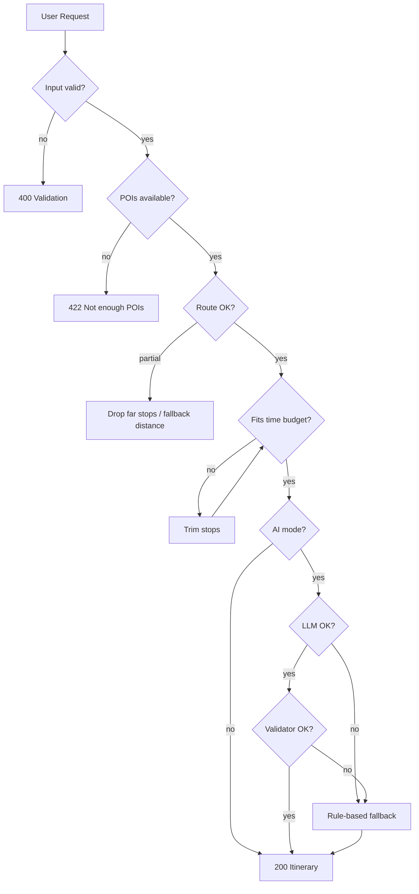

# Edge Cases: TripPilot AI (Delhi MVP)

Detailed edge-case catalog for implementation and QA, derived from [problemStatement.md](./problemStatement.md) and [architecture.md](./architecture.md).

**How to read this doc**

| Field | Meaning |
|-------|---------|
| **ID** | Stable reference (`EC-<phase>-<nn>`) |
| **Priority** | P0 = must handle for MVP ship; P1 = should handle; P2 = nice-to-have / post-MVP |
| **Layer** | Architecture phase(s) primarily responsible |
| **Expected behavior** | What the system should do (not implementation detail) |

**Severity (user impact)**

| Level | Definition |
|-------|------------|
| **Critical** | Broken itinerary, wrong city, safety/trust failure, or total failure with no message |
| **High** | Unusable or highly misleading plan; user must restart |
| **Medium** | Degraded but acceptable plan; clear messaging |
| **Low** | Cosmetic, rare, or easily recoverable |

---

## Summary Matrix

| Category | Count | P0 |
|----------|-------|-----|
| User input & onboarding | 18 | 12 |
| Geography & scope | 10 | 8 |
| POI data (OSM / store) | 22 | 14 |
| Routing & optimization | 20 | 12 |
| Scheduling, hours & time budget | 16 | 11 |
| Rule-based planner | 14 | 9 |
| AI layer | 16 | 10 |
| Cost estimation | 8 | 4 |
| External APIs & resilience | 14 | 10 |
| UI / UX | 12 | 7 |
| Weather & enrichments (Phase 6) | 8 | 2 |
| Security, abuse & privacy | 10 | 6 |
| **Total** | **168** | **105** |

---

## 1. User Input & Onboarding

| ID | Scenario | Severity | Priority | Layer | Expected behavior |
|----|----------|----------|----------|-------|-------------------|
| EC-U-01 | No interests selected | High | P0 | 3, 5 | Block submit with inline error: “Select at least one interest.” |
| EC-U-02 | All interests selected (food, history, nightlife, nature) | Medium | P1 | 3 | Cap diversity in selector; avoid 8+ stops; prefer mixed categories within time budget. |
| EC-U-03 | Single interest only (e.g. only “food”) | Medium | P0 | 3 | Generate food-focused plan; allow 3–6 stops; avoid duplicate same-type venues if possible. |
| EC-U-04 | Conflicting interests (e.g. nature + nightlife for 4h morning slot) | Medium | P1 | 3, 5 | Still generate plan; nightlife venues after 17:00 if hours known; else warn in `meta.warnings`. |
| EC-U-05 | Budget not selected | High | P0 | 5 | Block submit; default must not be assumed silently. |
| EC-U-06 | Duration not selected | High | P0 | 5 | Block submit. |
| EC-U-07 | Invalid duration value (tampered API: `duration_minutes: 99999`) | High | P0 | 3 | Reject with `400`; only allow mapped values (240, 480, 1440 or configured set). |
| EC-U-08 | Invalid budget tier (e.g. `"ultra"` ) | High | P0 | 3 | Reject with `400`; enum: `low` \| `medium` \| `high`. |
| EC-U-09 | Empty request body to `/itinerary/generate` | High | P0 | 3 | `400` with field-level validation errors. |
| EC-U-10 | Malformed JSON / wrong content-type | Medium | P0 | 3 | `400` “Invalid JSON body.” |
| EC-U-11 | Extra unknown fields in request | Low | P2 | 3 | Ignore unknown fields (forward-compatible) or strip in validator. |
| EC-U-12 | User selects “low” budget but all interests are premium-heavy (fine dining + museums) | Medium | P1 | 3 | Reduce stop count; prefer free/low-cost POIs; add `meta.warnings` about budget fit. |
| EC-U-13 | User selects “high” budget with only parks (nature) | Low | P2 | 3 | Valid plan; cost estimates may be low — no error. |
| EC-U-14 | Optional start location omitted | Medium | P0 | 2, 3 | Default start: geographic centroid of Delhi NCR or configurable landmark (India Gate). Document in response `meta.start_point`. |
| EC-U-15 | Start location provided outside Delhi NCR | High | P0 | 0, 2, 3 | Clamp to nearest in-bounds point OR reject with message: “Start point must be within Delhi NCR.” (pick one policy; document in config). |
| EC-U-16 | Start location valid but far from all candidates (e.g. edge of NCR) | Medium | P1 | 2 | First leg may be long; validator may drop distant POIs or warn if first leg &gt; threshold (e.g. 45 min walk). |
| EC-U-17 | User submits same preferences repeatedly (double-click) | Medium | P1 | 5 | Debounce generate button; idempotent-ish response (new `itinerary_id` each time OK). |
| EC-U-18 | Unicode / emoji in optional text fields (future: notes) | Low | P2 | 5 | Sanitize length; accept UTF-8; reject control chars. |

---

## 2. Geography & Scope (Delhi NCR)

| ID | Scenario | Severity | Priority | Layer | Expected behavior |
|----|----------|----------|----------|-------|-------------------|
| EC-G-01 | User implicitly expects Gurgaon/Noida/Faridabad — all inside NCR bounds | Medium | P0 | 0, 1 | Include in `NCR_BOUNDS`; POIs in satellite cities allowed if inside bbox. |
| EC-G-02 | User wants Jaipur/Agra (out of scope) | High | P0 | 1, 3, 5 | No POIs returned; message: “MVP supports Delhi NCR only.” |
| EC-G-03 | POI lat/lon exactly on bounding box edge | Low | P1 | 1 | Inclusive boundary check (`>= min`, `<= max`). |
| EC-G-04 | POI slightly outside bbox due to bad OSM data | Medium | P0 | 1 | Filter out at ingest; log for data quality. |
| EC-G-05 | `GET /pois?bbox=` spanning outside NCR | Medium | P0 | 1 | Clip query to intersection with `NCR_BOUNDS` or reject if mostly outside. |
| EC-G-06 | Coordinates swapped (lon, lat) in client | High | P0 | 2, 5 | Validate lat ∈ [-90,90], lon ∈ [-180,180]; Delhi-ish sanity: lat ~28–29, lon ~76–78. |
| EC-G-07 | Null Island (0, 0) coordinates | High | P0 | 2 | Reject start point. |
| EC-G-08 | Multi-day trip requested via API hack (`duration_minutes: 2880`) | High | P0 | 3 | Reject; max = 1 day per problem statement. |
| EC-G-09 | Half-day plan crossing midnight (start 22:00, 4h) | Medium | P1 | 3 | Allow times past midnight in schema OR cap start latest 20:00 for 4h — document policy. |
| EC-G-10 | Delhi pollution / bandh / metro shutdown (real-world) | Low | P2 | 4, 6 | Not in MVP; optional disclaimer in UI footer. |

---

## 3. POI Data Layer (Phase 1)

| ID | Scenario | Severity | Priority | Layer | Expected behavior |
|----|----------|----------|----------|-------|-------------------|
| EC-P-01 | Overpass API timeout (504) | High | P0 | 1 | Serve from local POI cache; if cache empty, `503` with retry message. |
| EC-P-02 | Overpass rate limit / 429 | High | P0 | 1 | Backoff; never hammer on user request path — ingest async only. |
| EC-P-03 | Overpass returns empty result for category | High | P0 | 1, 3 | Widen tag mapping once; if still empty, fail generation with “Not enough places for [interest].” |
| EC-P-04 | POI missing `name` in OSM | Medium | P0 | 1 | Use fallback: `"Unnamed cafe"` + category label; include in response. |
| EC-P-05 | Duplicate POIs (same place, node + way) | Medium | P1 | 1 | Dedupe by proximity (&lt;50m) + similar name at ingest. |
| EC-P-06 | POI with invalid/missing coordinates | High | P0 | 1 | Drop at ingest; log count. |
| EC-P-07 | POI on river/island/inaccessible OSM geometry | Medium | P2 | 2 | Routing may fail leg; drop POI from plan if unreachable. |
| EC-P-08 | Stale cache (venue closed permanently) | Medium | P2 | 1, 6 | Scheduled refresh; MVP: accept staleness; no hard guarantee. |
| EC-P-09 | Category tag ambiguous (`tourism=yes` only) | Medium | P1 | 1 | Map to `attraction` or `unknown`; lower rank in selector. |
| EC-P-10 | Interest “nightlife” but query at ingest returns bars with no opening_hours | Medium | P1 | 3 | Assume evening-only; schedule after 17:00. |
| EC-P-11 | Very dense area (Chandni Chowk) — hundreds of food POIs | Medium | P1 | 1, 3 | Paginate ingest; selector picks top N by diversity + distance spread. |
| EC-P-12 | Sparse area (outer NCR) — few POIs for interest | High | P0 | 3 | Relax distance rules or reduce stops; message if &lt; 3 candidates. |
| EC-P-13 | `GET /pois?category=invalid` | Low | P0 | 1 | `400` unknown category enum. |
| EC-P-14 | SQL/DB store corrupted or missing file | Critical | P0 | 1 | Health check fails POI subsystem; `503` on generate. |
| EC-P-15 | Ingest job interrupted mid-write | High | P0 | 1 | Transaction or write-to-temp-then-swap; never serve half DB. |
| EC-P-16 | OSM offensive or junk names | Low | P2 | 1, 4 | Optional blocklist; LLM must not amplify slurs in notes. |
| EC-P-17 | Religious/sensitive sites without visit etiquette | Low | P2 | 4 | Wikipedia/LLM notes: dress code only if in source data. |
| EC-P-18 | Museum with `fee=yes` on low budget | Medium | P1 | 3 | Deprioritize or skip; prefer free monuments/parks. |
| EC-P-19 | POI `opening_hours` in OSM opening_hours format | Medium | P1 | 3 | Parse subset (Mo-Su 09:00-17:00); unparseable → default daytime. |
| EC-P-20 | POI `opening_hours: 24/7` | Low | P1 | 3 | Always schedulable. |
| EC-P-21 | POI closed on specific weekday (user plans for Sunday) | High | P1 | 3, 5 | If plan date supported: exclude; if not in MVP (no date picker): assume “typical weekday” + warning. |
| EC-P-22 | Two POIs same name (“Starbucks”) — disambiguation | Medium | P1 | 3, 5 | Show area/neighborhood in UI from lat/lon reverse hint or OSM `addr:*`. |

---

## 4. Routing & Optimization (Phase 2)

| ID | Scenario | Severity | Priority | Layer | Expected behavior |
|----|----------|----------|----------|-------|-------------------|
| EC-R-01 | OSRM public demo down | High | P0 | 2 | Fallback to OpenRouteService if configured; else haversine estimate × walking factor + warning flag. |
| EC-R-02 | OSRM returns `NoRoute` between two POIs | High | P0 | 2 | Try alternate mode once; else remove farther POI from set and re-optimize. |
| EC-R-03 | Single POI in optimize request | Low | P0 | 2 | Return trivial order; zero legs. |
| EC-R-04 | Two POIs only | Low | P0 | 2 | One leg; validate time budget. |
| EC-R-05 | Nine POIs requested (over selector cap) | Medium | P0 | 2 | Reject or truncate to max N (e.g. 8) with `400`. |
| EC-R-06 | Identical coordinates for two POIs | Medium | P1 | 2 | Travel time 0; merge or skip duplicate stop. |
| EC-R-07 | Matrix request N&gt;50 (OSRM limit) | Medium | P1 | 2 | Batch matrix in chunks; merge results. |
| EC-R-08 | Walking time unrealistic (bridge/highway) | Medium | P2 | 2 | Cap single leg at e.g. 60 min walk; else drop stop. |
| EC-R-09 | User expects driving; MVP is walking only | Medium | P0 | 2, 5 | UI shows “Walking times”; ignore `mode=driving` or map to future phase. |
| EC-R-10 | Monsoon flooding — OSM paths outdated | Low | P2 | 2 | Not modeled; disclaimer only. |
| EC-R-11 | TSP heuristic suboptimal order | Low | P1 | 2 | Acceptable for MVP; total time must still pass validator. |
| EC-R-12 | Optimizer order violates opening hours sequence | High | P1 | 3 | Re-run schedule builder with time windows; swap order if needed. |
| EC-R-13 | Circular route (return to start) not requested | Low | P2 | 2 | MVP: open route (no return leg) unless product adds option. |
| EC-R-14 | Start point not a POI in list | Medium | P0 | 2 | Matrix from `start_lat/lon` to first stop included in leg 0. |
| EC-R-15 | Invalid `poi_id` in optimize request | High | P0 | 2 | `400` listing unknown IDs. |
| EC-R-16 | Partial `poi_id` list (some deleted from DB) | High | P0 | 2 | `404` or `400` “Unknown POI”; do not silent skip without log. |
| EC-R-17 | Negative or zero coordinates in routing | High | P0 | 2 | `400` validation error. |
| EC-R-18 | Concurrent optimize requests overload OSRM | Medium | P1 | 2 | In-memory rate limit per IP; queue or 429. |
| EC-R-19 | Leg duration 0 for distant points (API bug) | High | P0 | 2 | Sanity check: if distance &gt; 500m and duration 0, re-fetch or use fallback estimate. |
| EC-R-20 | Crossing state border within NCR (tax/signage irrelevant) | Low | P2 | 2 | No special handling. |

---

## 5. Scheduling, Opening Hours & Time Budget

| ID | Scenario | Severity | Priority | Layer | Expected behavior |
|----|----------|----------|----------|-------|-------------------|
| EC-T-01 | Sum(visit + travel) &gt; duration budget | High | P0 | 3 | Remove lowest-priority stop and re-validate; repeat until fits or min 2 stops. |
| EC-T-02 | Cannot fit even 2 stops in 4h (far apart) | High | P0 | 3 | Return `422` with suggestion: increase duration or narrow interests. |
| EC-T-03 | Default visit duration too long for category | Medium | P1 | 3 | Cap per category table (e.g. cafe 45m, monument 60m). |
| EC-T-04 | User 4h budget but 6 stops selected internally | High | P0 | 3 | Selector must respect budget before optimize. |
| EC-T-05 | No buffer between stops (back-to-back) | Medium | P1 | 3 | Add 10–15 min buffer between arrive/depart in builder config. |
| EC-T-06 | First stop scheduled before venue opens | High | P1 | 3 | Shift `start_time` later or reorder. |
| EC-T-07 | Last stop ends after closing time | High | P1 | 3 | Shorten visit or drop stop; warn in `meta.warnings`. |
| EC-T-08 | Lunch window (12:00–14:00) for food interest | Medium | P2 | 3 | Prefer scheduling food POI in window when 8h+ plan. |
| EC-T-09 | Plan starts at user-provided `start_time` in past (same day) | Medium | P2 | 3 | Default to next rounded hour “now” if in API. |
| EC-T-10 | 1-day plan with 8h effective walking only — fatigue | Low | P2 | 3 | Optional max walking minutes per day in validator. |
| EC-T-11 | Time strings not ISO — local `HH:mm` only | Low | P0 | 3, 5 | Consistent 24h format in JSON; UI locale display OK. |
| EC-T-12 | DST not applicable (India) | Low | P0 | 3 | IST only; no DST logic required. |
| EC-T-13 | Stop order 1..N not contiguous in response | Medium | P0 | 3 | Validator rejects malformed itinerary before response. |
| EC-T-14 | `travel_to_next_minutes` on last stop | Low | P0 | 3 | `null` or `0` on final stop. |
| EC-T-15 | Regenerate with same seed should be deterministic (rule-based) | Medium | P1 | 3 | Same input → same output unless POI DB changed. |
| EC-T-16 | Regenerate AI mode non-deterministic | Low | P1 | 4 | Document; acceptable if POI set unchanged and validator passes. |

---

## 6. Rule-Based Planner (Phase 3)

| ID | Scenario | Severity | Priority | Layer | Expected behavior |
|----|----------|----------|----------|-------|-------------------|
| EC-PL-01 | Zero candidates after filter | High | P0 | 3 | `422` “Could not build itinerary”; suggest different interests. |
| EC-PL-02 | Only 1 candidate after filter | High | P0 | 3 | `422` or 1-stop “micro itinerary” with warning — product choice: min 2 stops. |
| EC-PL-03 | Candidates all same category (filter too narrow) | Medium | P1 | 3 | Inject one POI from secondary interest if multi-select. |
| EC-PL-04 | Budget low + only paid museums in shortlist | High | P0 | 3 | Replace with free alternatives from POI pool. |
| EC-PL-05 | Orchestrator timeout (internal &gt; 60s) | High | P0 | 3 | Abort; `504`; partial logs; no half JSON. |
| EC-PL-06 | Race: POI deleted between list and optimize | Medium | P1 | 3 | Retry once with refreshed list. |
| EC-PL-07 | `mode=ai` requested but LLM key missing | High | P0 | 4 | Fallback to rule-based + `meta.fallback_reason`. |
| EC-PL-08 | `mode=rule` explicit — skip LLM | Low | P0 | 3 | Never call LLM. |
| EC-PL-09 | Response schema version mismatch | Medium | P0 | 3 | Include `schema_version` in `meta`; UI checks compatibility. |
| EC-PL-10 | Extremely long POI name breaks UI | Low | P1 | 5 | Truncate display at 80 chars with ellipsis. |
| EC-PL-11 | Itinerary valid JSON but fails JSON Schema | High | P0 | 3 | Never send; internal error 500 + log. |
| EC-PL-12 | Summary totals don’t match stops (math drift) | Medium | P0 | 3 | Recompute summary server-side; don’t trust LLM totals. |
| EC-PL-13 | Duplicate `poi_id` in same itinerary | High | P0 | 3 | Validator rejects; regenerate. |
| EC-PL-14 | Interest mapping gap (new interest added in UI, not backend) | High | P0 | 3, 5 | `400` unknown interest enum. |

---

## 7. AI Layer (Phase 4)

| ID | Scenario | Severity | Priority | Layer | Expected behavior |
|----|----------|----------|----------|-------|-------------------|
| EC-AI-01 | LLM invents `poi_id` not in shortlist | Critical | P0 | 4 | Validator rejects; fallback to rule-based itinerary. |
| EC-AI-02 | LLM removes stops without adjusting times | High | P0 | 4 | Recompute schedule from validated stops only. |
| EC-AI-03 | LLM adds extra stops | High | P0 | 4 | Strip unknown stops; if &lt; min stops, fallback. |
| EC-AI-04 | LLM changes visit order → breaks route optimality | Medium | P0 | 4 | Re-run route optimizer on final ID list. |
| EC-AI-05 | LLM output not valid JSON | High | P0 | 4 | Retry once with “JSON only”; then fallback. |
| EC-AI-06 | LLM timeout (&gt; 30s) | High | P0 | 4 | Return rule-based + `meta.ai_status: timeout`. |
| EC-AI-07 | LLM rate limit / 429 | High | P0 | 4 | Fallback rule-based; user message “AI busy, showing standard plan.” |
| EC-AI-08 | LLM suggests unsafe advice (“enter restricted area”) | High | P1 | 4 | System prompt forbids; no custom off-road routes in notes. |
| EC-AI-09 | LLM hallucinates prices | Medium | P0 | 4 | Cost fields overwritten by `Cost Estimator` server-side. |
| EC-AI-10 | LLM writes opening hours contradicting POI data | Medium | P0 | 4 | Notes only; schedule uses POI DB hours. |
| EC-AI-11 | Prompt injection in future “user notes” field | High | P1 | 4 | Sanitize; system prompt ignores instructions in user content. |
| EC-AI-12 | Context window exceeded (too many POIs in prompt) | Medium | P0 | 4 | Cap shortlist to top 20 by score; summarize rest. |
| EC-AI-13 | Model returns right schema but wrong `arrive_at` sequence | High | P0 | 4 | Schedule builder re-derives times from order + legs. |
| EC-AI-14 | Pattern B: LLM selects 1 POI only | High | P0 | 4 | Enforce min stops in validator; expand selection rule-based. |
| EC-AI-15 | Streaming partial JSON to UI | Low | P2 | 4, 5 | Optional; MVP can use single response. |
| EC-AI-16 | Multiple languages in output (Hindi + English) | Low | P2 | 4 | MVP: English only unless locale param added. |

---

## 8. Cost Estimation

| ID | Scenario | Severity | Priority | Layer | Expected behavior |
|----|----------|----------|----------|-------|-------------------|
| EC-C-01 | `cost_estimate_inr.low` &gt; `high` | Medium | P0 | 3 | Swap or reset; log data bug. |
| EC-C-02 | All stops free (parks, monuments) | Low | P0 | 3 | Summary low/high near 0; UI shows “Mostly free.” |
| EC-C-03 | Low budget but high estimate in summary | Medium | P1 | 3 | Warning in `meta.warnings`; suggest fewer paid stops. |
| EC-C-04 | Missing price data for restaurant | Medium | P1 | 3 | Use tier heuristic (low/medium/high ₹ range). |
| EC-C-05 | Currency assumed INR only | Low | P0 | 3 | Document; no FX. |
| EC-C-06 | User interprets estimate as exact | Medium | P1 | 5 | UI disclaimer: “Rough estimates, not quotes.” |
| EC-C-07 | LLM outputs cost in USD | Medium | P0 | 4 | Strip; recompute INR server-side. |
| EC-C-08 | Negative costs | High | P0 | 3 | Clamp to 0; validator error if persists. |

---

## 9. External APIs & Resilience

| ID | Scenario | Severity | Priority | Layer | Expected behavior |
|----|----------|----------|----------|-------|-------------------|
| EC-X-01 | All external APIs down simultaneously | Critical | P0 | 1–4 | `503` “Planner temporarily unavailable”; health endpoint red. |
| EC-X-02 | Partial degradation (OSRM down, cache OK) | High | P0 | 2, 3 | Generate with haversine fallback + warning. |
| EC-X-03 | OpenWeatherMap down (Phase 6) | Low | P1 | 6 | Skip weather bias; core flow works. |
| EC-X-04 | Wikipedia timeout for enrichment | Low | P2 | 6 | Empty `notes`; no failure. |
| EC-X-05 | Google Places quota exceeded | Low | P2 | 6 | Not required for MVP. |
| EC-X-06 | SSL/certificate errors to external API | High | P0 | 1, 2 | Retry with backoff; fail gracefully. |
| EC-X-07 | DNS failure | High | P0 | 1, 2 | Same as EC-X-01 for that dependency. |
| EC-X-08 | Slow Overpass during user request (cache miss) | High | P0 | 1 | Never block user on live Overpass — use cache only on hot path. |
| EC-X-09 | Clock skew on server | Low | P2 | 3 | Use server UTC for logging; schedule relative to `start_time` param. |
| EC-X-10 | Deployment with missing `NCR_BOUNDS` env | Critical | P0 | 0 | Fail fast at startup. |
| EC-X-11 | Deployment with empty POI DB | Critical | P0 | 1 | Health: `poi_count &gt; 0` for ready state. |
| EC-X-12 | Circuit breaker open on OSRM | Medium | P1 | 2 | Short-circuit to fallback for 60s. |
| EC-X-13 | Retry storm after outage | Medium | P1 | 1, 2 | Exponential backoff; max 3 retries. |
| EC-X-14 | Stale health: process up but DB read-only error | High | P0 | 0 | Health includes DB ping. |

---

## 10. UI / UX (Phase 5)

| ID | Scenario | Severity | Priority | Layer | Expected behavior |
|----|----------|----------|----------|-------|-------------------|
| EC-UI-01 | API error during generate | High | P0 | 5 | Error screen with retry; preserve form state. |
| EC-UI-02 | Slow response (&gt; 10s) | Medium | P0 | 5 | Loading state with progress copy; cancel optional P2. |
| EC-UI-03 | Empty itinerary returned (should not happen) | Critical | P0 | 5 | Treat as error; don’t render blank timeline. |
| EC-UI-04 | Mobile viewport — long itinerary | Medium | P1 | 5 | Scrollable timeline; sticky summary. |
| EC-UI-05 | Map tile load failure | Low | P1 | 5 | Hide map or static list; itinerary still visible. |
| EC-UI-06 | Share/export not implemented | Low | P2 | 5 | No broken share button in MVP. |
| EC-UI-07 | Browser back from result to form | Low | P1 | 5 | Form prefilled from state/sessionStorage. |
| EC-UI-08 | Offline user | Medium | P1 | 5 | Banner: “Internet required to generate.” |
| EC-UI-09 | Accessibility: screen reader for timeline | Medium | P2 | 5 | Semantic list order; aria labels on times. |
| EC-UI-10 | Very small screen (320px) | Medium | P1 | 5 | No horizontal overflow on cards. |
| EC-UI-11 | `meta.warnings` present | Medium | P0 | 5 | Yellow info banner above itinerary. |
| EC-UI-12 | Regenerate clears map markers incorrectly | Medium | P1 | 5 | Full re-render from new JSON. |

---

## 11. Weather & Enrichments (Phase 6)

| ID | Scenario | Severity | Priority | Layer | Expected behavior |
|----|----------|----------|----------|-------|-------------------|
| EC-W-01 | Heavy rain forecast | Medium | P1 | 6 | Boost indoor POIs (museums, cafes); warn outdoors deprioritized. |
| EC-W-02 | Extreme heat (&gt; 40°C) | Medium | P1 | 6 | Shorter outdoor segments; more breaks. |
| EC-W-03 | Weather API returns clear sky but user sees rain | Low | P2 | 6 | Disclaimer on forecast accuracy. |
| EC-W-04 | No indoor POIs in shortlist during rain | High | P1 | 6 | Proceed with best effort + warning. |
| EC-W-05 | Wikipedia no page for POI | Low | P2 | 6 | Generic category blurb or empty notes. |
| EC-W-06 | Wikipedia disambiguation page | Low | P2 | 6 | Skip auto-link; don’t show wrong history. |
| EC-W-07 | OpenWeather free tier daily limit hit | Medium | P1 | 6 | Cache forecast 3h; skip bias. |
| EC-W-08 | Plan without date — weather irrelevant | Medium | P0 | 6 | Don’t call weather API unless `plan_date` provided (post-MVP field). |

---

## 12. Security, Abuse & Privacy

| ID | Scenario | Severity | Priority | Layer | Expected behavior |
|----|----------|----------|----------|-------|-------------------|
| EC-S-01 | Unauthenticated scraping of `/pois` | Medium | P1 | 1 | Rate limit; optional API key later. |
| EC-S-02 | Spam `/itinerary/generate` (DoS) | High | P0 | 3 | Rate limit per IP (e.g. 10/min). |
| EC-S-03 | LLM API key leaked in client | Critical | P0 | 4, 5 | Keys server-side only. |
| EC-S-04 | SSRF via malicious `start_lat` URL field | High | P0 | 3 | No user-controlled URLs in server fetch. |
| EC-S-05 | PII in logs (future email) | Medium | P1 | 5 | Don’t log full request bodies in prod. |
| EC-S-06 | XSS from POI names in UI | High | P0 | 5 | Escape HTML in render. |
| EC-S-07 | SQL injection in POI search | High | P0 | 1 | Parameterized queries only. |
| EC-S-08 | Huge payload (10MB JSON) | Medium | P0 | 3 | Body size limit 64KB. |
| EC-S-09 | CORS misconfiguration in production | Medium | P0 | 0, 5 | Allow only frontend origin. |
| EC-S-10 | GDPR “delete my data” — no accounts MVP | Low | P2 | 5 | No persistent user data; document in privacy note. |

---

## 13. Cross-Cutting Flows (End-to-End)

### 13.1 Happy paths (regression anchors)

| ID | Flow | Expected |
|----|------|----------|
| EC-E2E-01 | Low budget, nature + history, 4h, default start | 3–4 stops, fits 240 min, all POIs in NCR |
| EC-E2E-02 | High budget, food only, 8h | 5–6 stops, lunch-ish scheduling if implemented |
| EC-E2E-03 | All interests, 1 day | Max stops within 1440 min, mixed categories |
| EC-E2E-04 | Rule-based then AI mode same input | Same POI IDs (AI may differ notes only if Pattern A) |
| EC-E2E-05 | Health check before deploy | `200` + POI count + dependency flags |

### 13.2 Failure composition



---

## 14. Standard API Error Contract

Align all edge cases to a consistent error shape:

```json
{
  "error": {
    "code": "INSUFFICIENT_POIS",
    "message": "Human-readable message",
    "details": { "interests": ["nightlife"], "min_required": 3 }
  }
}
```

| HTTP | Code | When |
|------|------|------|
| 400 | `VALIDATION_ERROR` | EC-U*, EC-G-06, EC-P-13, EC-R-15 |
| 422 | `UNPROCESSABLE_PLAN` | EC-T-02, EC-PL-01, EC-P-03 (after retries) |
| 429 | `RATE_LIMITED` | EC-S-02, EC-R-18 |
| 503 | `SERVICE_UNAVAILABLE` | EC-P-01, EC-X-01, EC-P-14 |
| 504 | `GATEWAY_TIMEOUT` | EC-PL-05, EC-AI-06 |

Successful itineraries should include optional warnings:

```json
{
  "meta": {
    "warnings": ["Walking time to first stop is 38 minutes."],
    "fallback_reason": null,
    "ai_status": "ok",
    "data_quality": { "routing": "osrm", "poi_cache_age_hours": 12 }
  }
}
```

---

## 15. Test Priority Checklist (MVP Ship Gate)

**P0 tests (must automate or manual sign-off)**

- [ ] EC-U-01, EC-U-05, EC-U-06, EC-U-09, EC-U-14, EC-U-15  
- [ ] EC-G-02, EC-G-06, EC-G-08  
- [ ] EC-P-01, EC-P-03, EC-P-04, EC-P-06, EC-P-12, EC-P-14  
- [ ] EC-R-01, EC-R-02, EC-R-15, EC-R-19  
- [ ] EC-T-01, EC-T-02, EC-T-14  
- [ ] EC-PL-01, EC-PL-11, EC-PL-12, EC-PL-13  
- [ ] EC-AI-01, EC-AI-04, EC-AI-05, EC-AI-06, EC-AI-09  
- [ ] EC-X-01, EC-X-02, EC-X-08, EC-X-11  
- [ ] EC-UI-01, EC-UI-03, EC-UI-11  
- [ ] EC-S-02, EC-S-03, EC-S-06, EC-S-08  
- [ ] EC-E2E-01 through EC-E2E-03  

---

## 16. Traceability

| Source doc | Covered by sections |
|------------|---------------------|
| Problem: Delhi NCR only | §2, EC-G-* |
| Problem: day/half-day | §5, EC-T-*, EC-G-08 |
| Problem: free data only | §3, §9; no hard dep on Google |
| Problem: no flights/hotels | Out of scope — no EC unless API extended |
| Problem: LLM grounded in real POIs | §7, EC-AI-01–04 |
| Architecture Phase 0 | §2, EC-X-10 |
| Architecture Phase 1 | §3 |
| Architecture Phase 2 | §4 |
| Architecture Phase 3 | §5, §6 |
| Architecture Phase 4 | §7 |
| Architecture Phase 5 | §10 |
| Architecture Phase 6 | §11 |
| Architecture: fallback planner | EC-AI-*, EC-X-02, EC-PL-07 |
| Architecture: itinerary schema | §6, §14 |

---

## 17. Open Product Decisions

Record decisions here when resolved (affects multiple ECs):

| Decision | Options | Impacts |
|----------|---------|---------|
| Start outside NCR | Reject vs clamp to boundary | EC-U-15 |
| Minimum stops in itinerary | 2 vs 1 | EC-PL-02, EC-AI-14 |
| Plan date in MVP | Yes (enables EC-P-21) vs No (warnings only) | EC-P-21, EC-W-08 |
| Night start for 4h trip | Allow vs cap start time | EC-G-09 |
| Walking vs driving MVP | Walking only (recommended) | EC-R-09 |

---

*Last updated: aligned with problem statement and architecture phase model. Add new rows with next ID in category when scope changes.*
