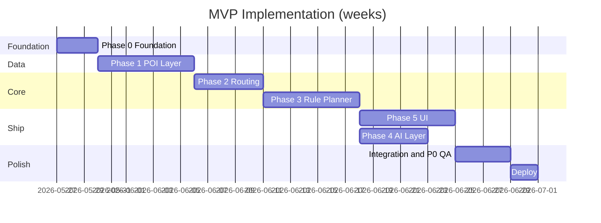
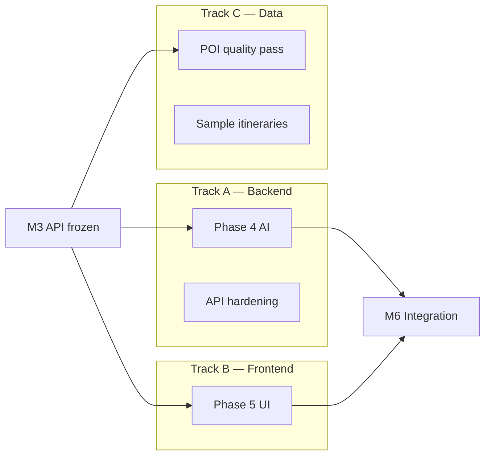

# Implementation Plan: AI Trip Planner (Delhi MVP)

Actionable build plan derived from [architecture.md](./architecture.md), [problemStatement.md](./problemStatement.md), and [edgeCases.md](./edgeCases.md).

> **Per-phase docs** live under [`docs/phases/`](../phases/). Phase 0 is complete: [`docs/phases/phase-0-foundation/`](../phases/phase-0-foundation/).

---

## 1. Objectives

| Goal | Success measure |
|------|-----------------|
| Ship MVP (Phases 0–5) | User completes onboarding → itinerary in &lt; 3 minutes |
| Data-grounded plans | Every stop has a real `poi_id` from OSM cache |
| Deterministic core first | Rule-based planner works before AI is enabled |
| Safe AI (Phase 4) | Groq on backend only; validator + fallback; zero hallucinated venues in P0 tests |
| Split apps | `frontend/` (Next.js) + `backend/` (FastAPI) deployed independently |
| Free-tier data | OSM/OSRM free; Groq free tier for LLM |

**Out of scope for this plan:** Phase 6 enhancements (tracked as backlog).

---

## 2. Fixed Stack (Frontend + Backend + Groq)

| App | Directory | Technology | Role |
|-----|-----------|------------|------|
| **Backend** | `backend/` | Python 3.11+, **FastAPI**, Uvicorn | REST API, POI DB, routing, planner, **Groq** |
| **Frontend** | `frontend/` | **Next.js 15** (App Router), TypeScript, Tailwind | UI only — calls backend via `fetch` |
| **Shared contract** | `shared/schemas/` | JSON Schema | Itinerary DTO shared by both apps |
| **LLM** | `backend/` only | **Groq** (`groq` SDK) | `GROQ_API_KEY` never exposed to browser |
| Monorepo | root | `pnpm` workspaces | `pnpm dev` runs frontend + backend |
| POI DB | `data/pois.db` | SQLite + SQLAlchemy | Owned by backend |
| Routing | backend service | OSRM + haversine fallback | — |
| Maps | `frontend/` | Leaflet + OSM tiles | — |
| Tests | per app | `pytest` (backend), `vitest` (frontend) | — |
| Deploy | split | Vercel → `frontend/`, Railway/Fly → `backend/` | Separate env files |

### Groq configuration (backend)

| Variable | Example | Purpose |
|----------|---------|---------|
| `GROQ_API_KEY` | `gsk_...` | From [console.groq.com](https://console.groq.com) |
| `GROQ_MODEL` | `llama-3.3-70b-versatile` | Default chat model |
| `GROQ_BASE_URL` | `https://api.groq.com/openai/v1` | Optional override |
| `GROQ_TIMEOUT_SEC` | `25` | Fallback to rule-based if exceeded |

Use `response_format: { "type": "json_object" }` for structured itinerary fields. Implement in `backend/app/services/ai/groq_client.py`.

---

## 3. Repository Layout

Create this structure in **Phase 0** (Day 1):

```
AITripPlanner/
├── DOC/
├── backend/                              # ← Python REST API
│   ├── app/
│   │   ├── main.py                       # FastAPI + CORS + /api/v1 router
│   │   ├── config.py                     # NCR_BOUNDS, Groq settings
│   │   ├── api/v1/
│   │   │   ├── router.py
│   │   │   ├── health.py
│   │   │   ├── pois.py
│   │   │   ├── route.py
│   │   │   └── itinerary.py
│   │   ├── models/                       # Pydantic request/response
│   │   ├── services/
│   │   │   ├── poi_service.py
│   │   │   ├── overpass_client.py
│   │   │   ├── routing_client.py
│   │   │   ├── planner/
│   │   │   │   ├── filter.py
│   │   │   │   ├── selector.py
│   │   │   │   ├── scheduler.py
│   │   │   │   ├── cost.py
│   │   │   │   └── orchestrator.py
│   │   │   └── ai/
│   │   │       ├── groq_client.py        # Groq chat completions
│   │   │       ├── context_builder.py
│   │   │       ├── prompts.py
│   │   │       └── validator.py
│   │   └── db/
│   │       ├── schema.sql
│   │       └── repository.py
│   ├── scripts/ingest_pois.py
│   ├── tests/
│   ├── pyproject.toml                    # deps: fastapi, groq, sqlalchemy, httpx
│   └── .env.example
├── frontend/                             # ← Next.js UI
│   ├── app/
│   │   ├── layout.tsx
│   │   ├── page.tsx                      # Landing /
│   │   ├── plan/page.tsx                 # Onboarding
│   │   └── itinerary/page.tsx            # Results
│   ├── components/
│   │   ├── plan/PlanForm.tsx
│   │   └── itinerary/
│   │       ├── ItineraryTimeline.tsx
│   │       ├── WarningsBanner.tsx
│   │       └── ItineraryMap.tsx
│   ├── lib/
│   │   ├── api.ts                        # Backend HTTP client
│   │   └── constants.ts                  # API URL, enums
│   ├── types/itinerary.ts
│   ├── package.json
│   └── .env.local.example                # NEXT_PUBLIC_API_URL only
├── shared/schemas/itinerary.schema.json
├── data/                                 # gitignore pois.db
├── pnpm-workspace.yaml
├── package.json                          # scripts: dev, dev:backend, dev:frontend
├── docker-compose.yml
├── Makefile
└── README.md
```

### Dev ports

| App | URL |
|-----|-----|
| Backend | `http://localhost:8000` (OpenAPI: `/docs`) |
| Frontend | `http://localhost:3000` |
| API base (from frontend) | `NEXT_PUBLIC_API_URL=http://localhost:8000/api/v1` |

---

## 4. Timeline Overview

Assumes **1 developer**, ~20–25 hrs/week. Adjust linearly for team size.



| Milestone | Phase | Duration | Cumulative |
|-----------|-------|----------|------------|
| M0: Skeleton running | 0 | 2–3 days | ~3 days |
| M1: Delhi POI DB + API | 1 | 5–7 days | ~10 days |
| M2: Route optimizer API | 2 | 4–5 days | ~15 days |
| M3: Full rule-based itinerary | 3 | 5–7 days | ~22 days |
| **M4: Demo without AI** | 3 + 5 (start UI early) | — | **~3 weeks** |
| M5: AI-enhanced itinerary | 4 | 4–5 days | ~27 days |
| M6: Shippable MVP | 5 finish + QA + deploy | 5–7 days | **~5–6 weeks** |

**Fast path to demo:** Start Phase 5 UI in parallel after M3 API contract is frozen (end of week 3).

---

## 5. Phase 0: Foundation — Complete

**Status:** Done  
**Folder:** [`docs/phases/phase-0-foundation/`](../phases/phase-0-foundation/)  
**Code:** [`backend/`](../../backend/), [`frontend/`](../../frontend/) at repo root

| Document | Contents |
|----------|----------|
| [README](../phases/phase-0-foundation/README.md) | Overview, deliverables, verify commands |
| [implementation.md](../phases/phase-0-foundation/implementation.md) | Tasks 0.B*, 0.F*, 0.M* (all done) |
| [checklist.md](../phases/phase-0-foundation/checklist.md) | Phase gate (passed) |
| [architecture.md](../phases/phase-0-foundation/architecture.md) | Phase 0 diagram & API |

Do **not** start Phase 1 until the [Phase 0 checklist](../phases/phase-0-foundation/checklist.md) passes.

---

## 6. Phase 1: POI Data Layer — Complete

**Folder:** [`docs/phases/phase-1-poi-data/`](../phases/phase-1-poi-data/)  
**Code:** `backend/app/db/`, `backend/scripts/ingest_pois.py`, `GET /api/v1/pois`

### 6.1 Tasks (done — details in phase folder)

| # | Task | Output | Est. |
|---|------|--------|------|
| 1.1 | SQLite schema: `pois` table matching architecture POI schema | `db/schema.sql` | 2h |
| 1.2 | Overpass query templates per interest category | `scripts/overpass_queries/` | 4h |
| 1.3 | `ingest_pois.py`: fetch → normalize → upsert (transactional) | CLI: `make ingest` | 6h |
| 1.4 | Normalizer: OSM tags → `category`, `tags`, default `visit_minutes` | Mapping table in code | 4h |
| 1.5 | Dedupe: &lt;50m + similar name | Cleaner dataset | 3h |
| 1.6 | Filter out-of-bounds / missing coords at ingest | EC-P-04, EC-P-06 | 2h |
| 1.7 | `POIRepository`: list by category, bbox, interest | Service layer | 3h |
| 1.8 | `GET /pois?category=&interest=&limit=` | API | 3h |
| 1.9 | Health: `poi_count` in `/health` | EC-X-11 | 1h |
| 1.10 | Seed check: ≥500 POIs across categories | Data QA script | 2h |

### 6.2 Overpass strategy

- **Never** call Overpass on user request path (EC-X-08).
- Ingest is manual/CI: `make ingest` weekly.
- Retry with exponential backoff (max 3) on 429/504 (EC-P-01, EC-P-02).

### 6.3 Phase gate

See [phase-1 checklist](../phases/phase-1-poi-data/checklist.md) — all passed.

### 6.4 Tests

- Ingest normalizer unit tests (tag → category)
- API integration test with fixture DB
- P0: EC-P-03, EC-P-04, EC-P-06, EC-P-14

---

## 7. Phase 2: Routing & Constraints — Complete

**Folder:** [`docs/phases/phase-2-routing/`](../phases/phase-2-routing/)  
**Code:** `backend/app/services/routing_*`, `POST /api/v1/route/optimize`

### 7.1 Tasks (done — details in phase folder)

| # | Task | Output | Est. |
|---|------|--------|------|
| 2.1 | `RoutingClient` interface + OSRM table implementation | `services/routing_client.py` | 4h |
| 2.2 | Haversine fallback × walking factor (1.3) + `meta.warnings` | EC-R-01 | 3h |
| 2.3 | Build N×N duration matrix (chunk if N&gt;50) | Matrix builder | 3h |
| 2.4 | Nearest-neighbor + optional 2-opt TSP | `order_optimizer.py` | 4h |
| 2.5 | `ConstraintValidator`: total visit + travel ≤ budget | Validator | 3h |
| 2.6 | Leg sanity: distance &gt;500m but duration 0 → refetch (EC-R-19) | Guard | 2h |
| 2.7 | `POST /route/optimize` | API per architecture sketch | 3h |
| 2.8 | Load POIs by id; reject unknown ids (EC-R-15) | 400 errors | 2h |

### 7.2 Request/response (implement exactly)

**Request**

```json
{
  "poi_ids": ["osm:node/1", "osm:node/2"],
  "start_lat": 28.6129,
  "start_lon": 77.2295,
  "mode": "walking",
  "max_total_minutes": 480
}
```

**Response**

```json
{
  "ordered_poi_ids": ["osm:node/2", "osm:node/1"],
  "legs": [
    { "from": "start", "to": "osm:node/2", "duration_min": 18 },
    { "from": "osm:node/2", "to": "osm:node/1", "duration_min": 22 }
  ],
  "warnings": []
}
```

### 7.3 Phase gate

See [phase-2 checklist](../phases/phase-2-routing/checklist.md) — all passed.

### 7.4 Tests

- Fixture POIs in central Delhi; assert ordered legs monotonic
- P0: EC-R-01, EC-R-02, EC-R-15, EC-R-19

---

## 8. Phase 3: Rule-Based Planner (Days 16–22)

### 8.1 Tasks

| # | Task | Output | Est. |
|---|------|--------|------|
| 3.1 | Freeze `shared/schemas/itinerary.schema.json` | Contract for FE + AI | 2h |
| 3.2 | Request model: `budget`, `interests[]`, `duration`, optional `start_*` | Pydantic | 2h |
| 3.3 | `PreferenceFilter`: interests → categories; budget rules | `filter.py` | 4h |
| 3.4 | `CandidateSelector`: top N=5–8, category diversity | `selector.py` | 4h |
| 3.5 | Integrate route optimizer + trim stops if over budget | Loop until fits | 4h |
| 3.6 | `ScheduleBuilder`: start 09:00 default, buffers 10–15 min | `scheduler.py` | 4h |
| 3.7 | Opening hours: parse simple OSM strings; evening for nightlife | EC-P-19, EC-U-04 | 4h |
| 3.8 | `CostEstimator`: INR ranges by tier + category | `cost.py` | 3h |
| 3.9 | `PlannerOrchestrator`: wire POI → filter → select → route → schedule → cost | Single entry | 3h |
| 3.10 | `POST /itinerary/generate` (`mode=rule` default) | API | 2h |
| 3.11 | Recompute `summary` server-side (never trust client) | EC-PL-12 | 2h |
| 3.12 | `meta.warnings`, `meta.start_point`, `schema_version` | Response enrich | 1h |

### 8.2 Orchestrator flow (pseudocode)

```
validate_request()
candidates = poi_service.by_interests(interests)
shortlist = selector.select(filter.apply(candidates), n=8)
order = route_optimizer.optimize(shortlist, start, budget_minutes)
while not validator.fits(order) and len(order) > 2:
    order = drop_lowest_priority_stop(order)
if len(order) < 2: raise UNPROCESSABLE_PLAN
schedule = scheduler.build(order)
return itinerary_builder.assemble(schedule, cost_estimator)
```

### 8.3 Phase gate

- [ ] `POST /itinerary/generate` with `{ budget, interests, duration: "8h" }` → valid schema
- [ ] E2E-01, E2E-02, E2E-03 from edgeCases pass (manual or automated)
- [ ] Same input → same output (deterministic)

### 8.4 Tests

- Unit: filter, selector, scheduler, cost
- Integration: full generate with test DB
- P0: EC-U-01, EC-U-07, EC-U-09, EC-T-01, EC-T-02, EC-PL-01, EC-PL-13

---

## 9. Phase 4: AI Layer — Groq (Days 23–27, backend only)

**Pattern A (recommended):** Rule-based itinerary first; Groq enriches `notes` and tips. Order/times from Phase 3 unless validator allows minor reorder → re-run optimizer.

**All tasks below are in `backend/`** — the frontend only passes `?mode=ai`.

### 9.1 Backend tasks (Groq)

| # | Task | Output | Est. |
|---|------|--------|------|
| 4.1 | `GroqClient` using official `groq` package | `services/ai/groq_client.py` | 3h |
| 4.2 | Wire `GROQ_API_KEY`, `GROQ_MODEL` via pydantic-settings | `config.py` | 1h |
| 4.3 | `chat.completions` with `response_format: json_object` | Structured parse | 3h |
| 4.4 | `ContextBuilder`: closed POI list + prefs + draft itinerary | `context_builder.py` | 3h |
| 4.5 | Prompt templates in `prompts.py` — “only provided poi_ids” | System + user prompts | 2h |
| 4.6 | `ItineraryValidator`: poi_ids ⊆ shortlist; re-run optimizer if order changes | EC-AI-01–04 | 4h |
| 4.7 | Fallback to rule-based on Groq error/timeout/429 | EC-AI-05–07 | 2h |
| 4.8 | `POST /api/v1/itinerary/generate?mode=ai` | API route | 2h |
| 4.9 | Overwrite costs from `CostEstimator`; fix summary | EC-AI-09 | 2h |
| 4.10 | Cap context POIs to 20; log token usage | EC-AI-12 | 1h |
| 4.11 | Mock Groq in tests (`pytest` monkeypatch) | No live API in CI | 2h |

### 9.1b Groq client sketch

```python
from groq import Groq

client = Groq(api_key=settings.GROQ_API_KEY)
response = client.chat.completions.create(
    model=settings.GROQ_MODEL,
    messages=[{"role": "system", "content": system_prompt}, {"role": "user", "content": user_payload}],
    response_format={"type": "json_object"},
    temperature=0.3,
    timeout=settings.GROQ_TIMEOUT_SEC,
)
```

### 9.2 Frontend tasks (wire AI mode)

| # | Task | Output | Est. |
|---|------|--------|------|
| 4.F1 | Checkbox “Enhance with AI (Groq)” on plan form | Sets `mode=ai` query param | 1h |
| 4.F2 | Longer loading copy when `mode=ai` | UX expectation | 0.5h |
| 4.F3 | Show `meta.ai_status` / `meta.fallback_reason` in warnings banner | Transparency | 1h |

### 9.3 Phase gate

- [ ] Groq called only from backend (grep `GROQ` in `frontend/` → no matches except docs)
- [ ] AI mode returns same `poi_id` set as rule mode in narrator-only tests
- [ ] Mock invalid `poi_id` in Groq response → fallback triggered
- [ ] p95 latency &lt; 30s or fallback under `GROQ_TIMEOUT_SEC`

### 9.4 Tests

- Mock Groq in `backend/tests/test_groq_planner.py`
- P0: EC-AI-01, EC-AI-05, EC-AI-06, EC-AI-09, EC-S-03

---

## 10. Phase 5: Frontend Application (Days 18–25, overlap after Phase 3)

Expand **`frontend/`** once `shared/schemas/itinerary.schema.json` is frozen (~Day 16). Backend endpoints must be live on `localhost:8000`.

### 10.1 Frontend tasks (`frontend/`)

| # | Task | Output | Est. |
|---|------|--------|------|
| 5.1 | `types/itinerary.ts` from shared JSON schema | Typed DTOs | 2h |
| 5.2 | `lib/api.ts`: `generateItinerary(body, mode?)` | POST `/api/v1/itinerary/generate` | 3h |
| 5.3 | **Landing** `app/page.tsx` — value prop, CTA → `/plan` | Marketing | 2h |
| 5.4 | **PlanForm** — budget, interests, duration | `app/plan/page.tsx` | 4h |
| 5.5 | Client validation (EC-U-01, EC-U-05, EC-U-06) | Block bad submit | 2h |
| 5.6 | Loading + debounced submit (EC-U-17) | `useTransition` or debounce | 2h |
| 5.7 | Navigate to `/itinerary` with result in sessionStorage | State handoff | 2h |
| 5.8 | **ItineraryTimeline** component | Stops + travel legs | 6h |
| 5.9 | **WarningsBanner** — `meta.warnings`, fallback reason | EC-UI-11 | 1h |
| 5.10 | Error UI + retry (EC-UI-01) | Parse `error.message` | 2h |
| 5.11 | **ItineraryMap** — Leaflet + OSM tiles | EC-UI-05 graceful degrade | 4h |
| 5.12 | Cost disclaimer footer | EC-C-06 | 0.5h |
| 5.13 | Responsive pass (375px+) | EC-UI-10 | 2h |

### 10.1b Backend tasks (supporting frontend, if not done)

| # | Task | Output | Est. |
|---|------|--------|------|
| 5.B1 | OpenAPI export; optional codegen to `frontend/types/api.d.ts` | Type safety | 2h |
| 5.B2 | CORS production origin for Vercel URL | Deploy prep | 0.5h |

### 10.2 Phase gate

- [ ] Non-technical walkthrough: landing → form → itinerary &lt; 3 min
- [ ] Mobile 375px width usable
- [ ] Works with `mode=rule` before AI keys exist

### 10.3 Tests

- Vitest: form validation
- Manual: EC-UI-03, EC-E2E-01–03

---

## 11. Integration, QA & Deploy (Days 28–32)

### 11.1 Integration week checklist

| # | Activity | Owner |
|---|----------|-------|
| I.1 | Run P0 checklist from edgeCases §15 | QA |
| I.2 | Fix open product decisions (edgeCases §17): start outside NCR, min stops | PM/Dev |
| I.3 | Load test: 10 concurrent `/itinerary/generate` | Dev |
| I.4 | Rate limit: 10 req/min/IP on generate (EC-S-02) | Dev |
| I.5 | Security pass: XSS escape POI names, body size 64KB | Dev |
| I.6 | README: setup, ingest, env vars, demo URL | Dev |

### 11.2 Deploy steps

1. **API:** Railway/Fly — Dockerfile, env vars, persistent volume for `pois.db` OR bake DB in image for demo.
2. **Client:** Vercel — `NEXT_PUBLIC_API_URL` → production API.
3. **CI:** GitHub Actions — `lint`, `pytest`, `ingest` (optional scheduled weekly).

```yaml
# .github/workflows/ci.yml (sketch)
on: [push, pull_request]
jobs:
  api:
    runs-on: ubuntu-latest
    steps:
      - uses: actions/checkout@v4
      - run: pip install -e ./server && pytest server/tests
  client:
    runs-on: ubuntu-latest
    steps:
      - run: cd client && npm ci && npm run lint && npm test
```

### 11.3 Definition of Done (MVP ship)

- [ ] All Phase 0–5 architecture exit criteria met
- [ ] ≥105 P0 edge cases handled or explicitly deferred with ticket
- [ ] Demo URL public
- [ ] `make ingest` documented; POI count healthy

---

## 12. Phase 6 Backlog (Post-MVP)

| Item | Depends on | Est. |
|------|------------|------|
| OpenWeatherMap bias | Context builder | 1–2 days |
| Wikipedia notes enrichment | AI/scheduler | 1–2 days |
| Scheduled POI refresh | ingest script + cron | 1 day |
| Redis cache for OSRM matrix | Phase 2 | 2 days |
| `plan_date` + opening hours accuracy | UI + scheduler | 2–3 days |
| Pattern B: AI as POI selector | Phase 4 refactor | 3–4 days |

---

## 13. Parallel Workstreams

After **M3** (rule-based API done):



**Contract freeze point:** `shared/schemas/itinerary.schema.json` + OpenAPI export — no breaking changes without version bump.

---

## 14. API Contract Implementation Order

| Order | Endpoint | Phase | Consumer |
|-------|----------|-------|----------|
| 1 | `GET /health` | 0 | Ops, CI |
| 2 | `GET /pois` | 1 | Debug, tests |
| 3 | `POST /route/optimize` | 2 | Planner internal + tests |
| 4 | `POST /itinerary/generate` | 3 | UI, AI |
| 5 | `?mode=ai` query param | 4 | UI toggle |

Generate OpenAPI from FastAPI; optionally codegen `client/lib/api.ts` types.

---

## 15. Testing Strategy by Phase

| Phase | Unit | Integration | Manual |
|-------|------|-------------|--------|
| 0 | Geo utils | Health | curl |
| 1 | Normalizer | GET /pois | Browse categories |
| 2 | TSP, validator | POST /route/optimize | Map sanity |
| 3 | Filter, scheduler | POST /itinerary/generate | E2E scenarios |
| 4 | Validator, mock LLM | AI generate + fallback | Prompt review |
| 5 | Form validation | — | 3-min walkthrough |

**Fixture data:** `server/tests/fixtures/pois_delhi_sample.json` (20–30 POIs) for CI without live Overpass.

---

## 16. Environment Variables

| Variable | Phase | Required |
|----------|-------|----------|
| `DATABASE_URL` | 1 | Yes (`sqlite:///./data/pois.db`) |
| `CORS_ORIGINS` | 0 | Yes |
| `OSRM_BASE_URL` | 2 | Yes (default public demo) |
| `LLM_API_KEY` | 4 | Only for AI mode |
| `LLM_MODEL` | 4 | Yes if AI |
| `OPENWEATHER_API_KEY` | 6 | No |
| `NEXT_PUBLIC_API_URL` | 5 | Yes |

---

## 17. Risks & Mitigations

| Risk | Impact | Mitigation |
|------|--------|------------|
| Overpass rate limit / downtime | No fresh POIs | Cached SQLite; ship with pre-ingested DB |
| OSRM public demo unreliable | Bad routes | Haversine fallback + warnings |
| Sparse POIs in outer NCR | 422 errors | Widen bbox slightly; seed popular areas |
| LLM hallucination | Trust loss | Pattern A; strict validator; fallback |
| Scope creep (hotels, multi-city) | Delay | Enforce validators; refer to problem statement |
| 5–6 week estimate slips | — | Ship M4 demo without AI first |

---

## 18. Sprint-Style Task Board (Copy to Issues)

### Sprint 1 (Week 1): Foundation + POI
- [x] Phase 0 — [phase-0-foundation](../phases/phase-0-foundation/)
- [ ] 1.1–1.6 Schema + ingest
- [ ] 1.7–1.10 POI API + data QA

### Sprint 2 (Week 2): Routing + Planner core
- [ ] 2.1–2.8 Routing API
- [ ] 3.1–3.6 Schema + filter + selector + scheduler start

### Sprint 3 (Week 3): Planner complete + UI start
- [ ] 3.7–3.12 Orchestrator + generate API
- [ ] 5.1–5.5 UI scaffold + onboarding
- [ ] M3 phase gate + E2E tests

### Sprint 4 (Week 4): UI + AI
- [ ] 5.6–5.12 Itinerary UI + map
- [ ] 4.1–4.9 AI layer
- [ ] M4 demo (rule-based)

### Sprint 5 (Week 5–6): Ship
- [ ] I.1–I.6 Integration QA
- [ ] Deploy + docs
- [ ] M6 MVP sign-off

---

## 19. Document Traceability

| Architecture section | Implementation section |
|---------------------|------------------------|
| Phase 0 | [docs/phases/phase-0-foundation/](../phases/phase-0-foundation/) |
| Phase 1 | §6 |
| Phase 2 | §7 |
| Phase 3 | §8 |
| Phase 4 | §9 |
| Phase 5 | §10 |
| Phase 6 | §12 |
| API contract summary | §14 |
| NFRs | §11, §17 |
| Critical path 0→1→2→3→5 | §4, §13 |

| Edge cases | When to implement |
|------------|-------------------|
| P0 per phase | Phase 0: [checklist](../phases/phase-0-foundation/checklist.md); later phases in §6–10 |
| Full checklist | §11.1 (Integration week) |

---

## 20. Immediate Next Actions

1. ~~Phase 0~~ — complete → [docs/phases/phase-0-foundation/](../phases/phase-0-foundation/).
2. **Start Phase 1** — POI ingest; track in [docs/phases/phase-1-poi-data/](../phases/phase-1-poi-data/).
3. **Run first ingest** (when Phase 1 built) — `make ingest`; verify POI count ≥500.
4. **Resolve edgeCases §17** — start outside NCR = reject; min stops = 2.
5. **Open Sprint 2 issues** from §18 in GitHub.

---

*This plan is the execution companion to [architecture.md](./architecture.md). Update task estimates as actuals come in.*
